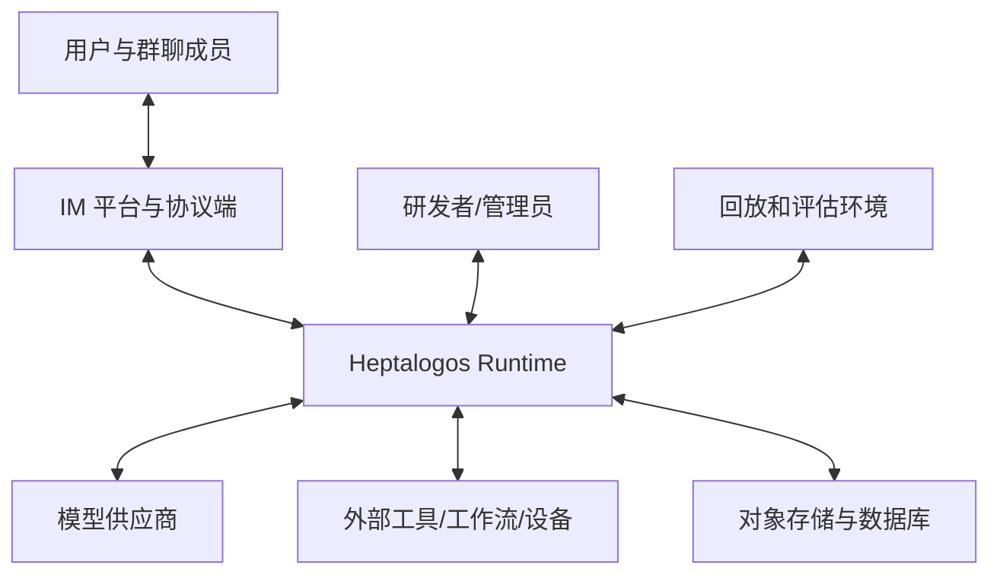

# 系统上下文

```mermaid
flowchart TB
    Users[用户与群聊成员]
    Admin[研发者/管理员]
    IM[IM 平台与协议端]
    Models[模型供应商]
    Tools[外部工具/工作流/设备]
    Storage[对象存储与数据库]
    Eval[回放和评估环境]
    H[Heptalogos Runtime]

    Users <--> IM
    IM <--> H
    Admin <--> H
    H <--> Models
    H <--> Tools
    H <--> Storage
    Eval <--> H
```

## 信任边界

- 平台事件和工具结果都是外部不可信输入；
- 模型输出是不确定提议，不是事实；
- 管理员操作具有高权限但仍需审计；
- 对象存储可能包含敏感媒体，访问必须通过引用和策略；
- 评估环境不得误连生产工具或真实用户渠道。
